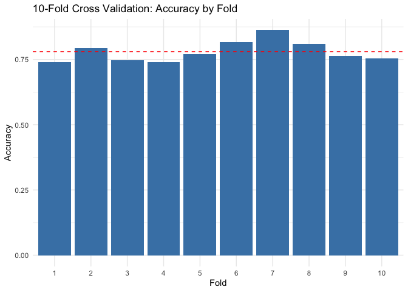
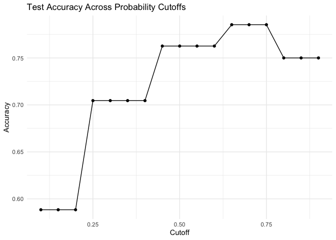

Lab 11 - Grading the professor, Pt. 2
================
Insert your name here
Insert date here

## Load packages and data

``` r
library(tidyverse) 
library(tidymodels)
```

    ## Warning: package 'infer' was built under R version 4.5.2

    ## Warning: package 'parsnip' was built under R version 4.5.2

    ## Warning: package 'rsample' was built under R version 4.5.2

``` r
library(openintro)
library(readxl)
library(titanic)
library(haven)
library(lmtest)
library(DescTools)

titanic3 <- read_excel("data/titanic3.xls",
    col_types = c("numeric", "numeric", "text",
        "text", "numeric", "numeric", "numeric",
        "text", "numeric", "text", "text",
        "text", "text", "text"))


data("titanic_train")
data("titanic_test")
```

## Exercise 1

There are 1309 observations and 14 variables in the titanic3 dataset.
There is some missing data on age, fare, boat, and body. The data on the
primary variables such as class, surival, and sex are complete.

``` r
# Rename columns to lowercase
names(titanic3) <- names(titanic3) %>% tolower()
names(titanic_train) <- names(titanic_train) %>% tolower()
names(titanic_test) <- names(titanic_test) %>% tolower()

# Convert pclass to factor

titanic_train <- titanic_train %>%
  mutate(pclass_ord = factor(pclass, ordered = TRUE, levels = c(3, 2, 1)))

titanic_test <- titanic_test %>%
  mutate(pclass_ord = factor(pclass, ordered = TRUE, levels = c(3, 2, 1)))

titanic3 <- titanic3 %>%
  mutate(pclass_ord = factor(pclass, ordered = TRUE, levels = c(3, 2, 1)))

glimpse(titanic3)
```

    ## Rows: 1,309
    ## Columns: 15
    ## $ pclass     <dbl> 1, 1, 1, 1, 1, 1, 1, 1, 1, 1, 1, 1, 1, 1, 1, 1, 1, 1, 1, 1,…
    ## $ survived   <dbl> 1, 1, 0, 0, 0, 1, 1, 0, 1, 0, 0, 1, 1, 1, 1, 0, 0, 1, 1, 0,…
    ## $ name       <chr> "Allen, Miss. Elisabeth Walton", "Allison, Master. Hudson T…
    ## $ sex        <chr> "female", "male", "female", "male", "female", "male", "fema…
    ## $ age        <dbl> 29.0000, 0.9167, 2.0000, 30.0000, 25.0000, 48.0000, 63.0000…
    ## $ sibsp      <dbl> 0, 1, 1, 1, 1, 0, 1, 0, 2, 0, 1, 1, 0, 0, 0, 0, 0, 0, 0, 0,…
    ## $ parch      <dbl> 0, 2, 2, 2, 2, 0, 0, 0, 0, 0, 0, 0, 0, 0, 0, 0, 1, 1, 0, 0,…
    ## $ ticket     <chr> "24160", "113781", "113781", "113781", "113781", "19952", "…
    ## $ fare       <dbl> 211.3375, 151.5500, 151.5500, 151.5500, 151.5500, 26.5500, …
    ## $ cabin      <chr> "B5", "C22 C26", "C22 C26", "C22 C26", "C22 C26", "E12", "D…
    ## $ embarked   <chr> "S", "S", "S", "S", "S", "S", "S", "S", "S", "C", "C", "C",…
    ## $ boat       <chr> "2", "11", NA, NA, NA, "3", "10", NA, "D", NA, NA, "4", "9"…
    ## $ body       <chr> NA, NA, NA, "135", NA, NA, NA, NA, NA, "22", "124", NA, NA,…
    ## $ home.dest  <chr> "St Louis, MO", "Montreal, PQ / Chesterville, ON", "Montrea…
    ## $ pclass_ord <ord> 1, 1, 1, 1, 1, 1, 1, 1, 1, 1, 1, 1, 1, 1, 1, 1, 1, 1, 1, 1,…

``` r
summary(titanic3)
```

    ##      pclass         survived         name               sex           
    ##  Min.   :1.000   Min.   :0.000   Length:1309        Length:1309       
    ##  1st Qu.:2.000   1st Qu.:0.000   Class :character   Class :character  
    ##  Median :3.000   Median :0.000   Mode  :character   Mode  :character  
    ##  Mean   :2.295   Mean   :0.382                                        
    ##  3rd Qu.:3.000   3rd Qu.:1.000                                        
    ##  Max.   :3.000   Max.   :1.000                                        
    ##                                                                       
    ##       age              sibsp            parch          ticket         
    ##  Min.   : 0.1667   Min.   :0.0000   Min.   :0.000   Length:1309       
    ##  1st Qu.:21.0000   1st Qu.:0.0000   1st Qu.:0.000   Class :character  
    ##  Median :28.0000   Median :0.0000   Median :0.000   Mode  :character  
    ##  Mean   :29.8811   Mean   :0.4989   Mean   :0.385                     
    ##  3rd Qu.:39.0000   3rd Qu.:1.0000   3rd Qu.:0.000                     
    ##  Max.   :80.0000   Max.   :8.0000   Max.   :9.000                     
    ##  NA's   :263                                                          
    ##       fare            cabin             embarked             boat          
    ##  Min.   :  0.000   Length:1309        Length:1309        Length:1309       
    ##  1st Qu.:  7.896   Class :character   Class :character   Class :character  
    ##  Median : 14.454   Mode  :character   Mode  :character   Mode  :character  
    ##  Mean   : 33.295                                                           
    ##  3rd Qu.: 31.275                                                           
    ##  Max.   :512.329                                                           
    ##  NA's   :1                                                                 
    ##      body            home.dest         pclass_ord
    ##  Length:1309        Length:1309        3:709     
    ##  Class :character   Class :character   2:277     
    ##  Mode  :character   Mode  :character   1:323     
    ##                                                  
    ##                                                  
    ##                                                  
    ## 

``` r
titanic3 <- titanic3 %>%
  mutate(sex = case_when(
    sex == "female" ~ 0,
    sex == "male" ~ 1
  ))
```

## Exercise 1.1

Fit a logistic regression predicting survival from passenger sex and
class (as a numeric variable). Save the model as m_apparent

``` r
m_apparent <- glm(survived ~ sex + pclass, data=titanic3, family = "binomial")
summary(m_apparent)
```

    ## 
    ## Call:
    ## glm(formula = survived ~ sex + pclass, family = "binomial", data = titanic3)
    ## 
    ## Coefficients:
    ##             Estimate Std. Error z value Pr(>|z|)    
    ## (Intercept)  2.96331    0.23511   12.60   <2e-16 ***
    ## sex         -2.51496    0.14671  -17.14   <2e-16 ***
    ## pclass      -0.86027    0.08502  -10.12   <2e-16 ***
    ## ---
    ## Signif. codes:  0 '***' 0.001 '**' 0.01 '*' 0.05 '.' 0.1 ' ' 1
    ## 
    ## (Dispersion parameter for binomial family taken to be 1)
    ## 
    ##     Null deviance: 1741.0  on 1308  degrees of freedom
    ## Residual deviance: 1257.2  on 1306  degrees of freedom
    ## AIC: 1263.2
    ## 
    ## Number of Fisher Scoring iterations: 4

``` r
confint(m_apparent)
```

    ## Waiting for profiling to be done...

    ##                 2.5 %     97.5 %
    ## (Intercept)  2.511346  3.4336114
    ## sex         -2.807040 -2.2315436
    ## pclass      -1.028941 -0.6953911

``` r
PseudoR2(m_apparent, which="CoxSnell")
```

    ##  CoxSnell 
    ## 0.3089801

``` r
lrtest(m_apparent)
```

    ## Likelihood ratio test
    ## 
    ## Model 1: survived ~ sex + pclass
    ## Model 2: survived ~ 1
    ##   #Df  LogLik Df  Chisq Pr(>Chisq)    
    ## 1   3 -628.62                         
    ## 2   1 -870.51 -2 483.79  < 2.2e-16 ***
    ## ---
    ## Signif. codes:  0 '***' 0.001 '**' 0.01 '*' 0.05 '.' 0.1 ' ' 1

## Excercise 1.2

Now we can use the model to generate predicted survival probabilities
for every passenger. For example, p_apparent says that for passenger 1,
the likelihood of survival is .89, so out of 100 identical voyages,
you’d expect passenger 1 to surive 89 times.

``` r
p_apparent <- predict(m_apparent, type = "response")
view(p_apparent)
```

## Exercise 1.3

To turn probabilities into decisions (we’re working for an insurance
agency after all), we need a decision rule. To keep things simple, we
will use a cutoff of 0.5: if the predicted probability is greater than
0.5, we predict survival (1); otherwise, we predict non-survival (0).

``` r
yhat_apparent <- ifelse(p_apparent > .5, 1, 0)
view(yhat_apparent)
```

## Exercise 1.4

Compute the model’s accuracy. We define accuracy as the proportion of
correct predictions (both survivors and non-survivors) out of all
passengers.

``` r
acc_apparent <- mean(yhat_apparent == titanic3$survived, na.rm = TRUE)
acc_apparent
```

    ## [1] 0.7799847

## Exercise 1.5 Reflection

1.  Why is apparent accuracy likely to be an overestimate of true
    predictive performance? The accuracy we get when using the same data
    that created the datafile is probably going to be the best its ever
    going to get, since the relationship between class, sex, and
    survival is going to be different if there were a hypothetical
    titanic type situation to compare it to. Then, the model would be
    less accurate in its predictions.

2.  Can you think of an analogy from everyday life where “testing on the
    same data you trained on” would give misleadingly good results?

I like to sometimes play the bots on chess.com for practice, but if you
play the same bot too many times, you get a sense for the general
strategy it assumes, and so you are more likely to beat it and assume
you are better than you actually are.

## Exercise 2.1

Fit the same model as before (survived ~ sex + pclass), but only on the
training data. Save it as m_split

``` r
m_split <-  glm(survived ~ sex + pclass, data=titanic_train, family = "binomial")
summary(m_split)
```

    ## 
    ## Call:
    ## glm(formula = survived ~ sex + pclass, family = "binomial", data = titanic_train)
    ## 
    ## Coefficients:
    ##             Estimate Std. Error z value Pr(>|z|)    
    ## (Intercept)   3.2946     0.2974  11.077   <2e-16 ***
    ## sexmale      -2.6434     0.1838 -14.380   <2e-16 ***
    ## pclass       -0.9606     0.1061  -9.057   <2e-16 ***
    ## ---
    ## Signif. codes:  0 '***' 0.001 '**' 0.01 '*' 0.05 '.' 0.1 ' ' 1
    ## 
    ## (Dispersion parameter for binomial family taken to be 1)
    ## 
    ##     Null deviance: 1186.7  on 890  degrees of freedom
    ## Residual deviance:  827.2  on 888  degrees of freedom
    ## AIC: 833.2
    ## 
    ## Number of Fisher Scoring iterations: 4

## Exercise 2.2

Let’s compute the model’s accuracy on the data it was trained on. This
is still “apparent” accuracy, but now limited to the training set.

``` r
p_train <- predict(m_split, type = "response")
yhat_train <- ifelse(p_train > 0.5, 1, 0)

acc_train <- mean(yhat_train == titanic_train$survived, na.rm = TRUE)
acc_train
```

    ## [1] 0.7867565

## Exercise 2.3

Now the real test. We evaluate this model on passengers it has never
seen, using titanic_test. Notice the crucial difference: we pass newdata
= titanic_test to predict(). This forces the model to make predictions
for passengers that played no role in fitting its coefficients.

``` r
survived <- titanic3 %>%
  select(c("name","survived"))

titanic_test <- merge(survived, titanic_test, by = "name")

p_test <- predict(m_split,
                  newdata = titanic_test,
                  type = "response")

yhat_test <- ifelse(p_test > 0.5, 1, 0)
yhat_test
```

    ##   1   2   3   4   5   6   7   8   9  10  11  12  13  14  15  16  17  18  19  20 
    ##   0   1   0   0   1   0   0   0   0   1   0   0   0   0   0   0   0   0   0   0 
    ##  21  22  23  24  25  26  27  28  29  30  31  32  33  34  35  36  37  38  39  40 
    ##   0   0   0   0   1   0   1   0   0   1   1   1   0   1   0   0   1   0   0   0 
    ##  41  42  43  44  45  46  47  48  49  50  51  52  53  54  55  56  57  58  59  60 
    ##   1   0   1   0   1   0   0   1   1   1   0   1   1   1   0   0   0   1   0   1 
    ##  61  62  63  64  65  66  67  68  69  70  71  72  73  74  75  76  77  78  79  80 
    ##   0   1   0   0   0   1   1   1   1   1   0   0   1   0   0   1   0   0   0   0 
    ##  81  82  83  84  85  86  87  88  89  90  91  92  93  94  95  96  97  98  99 100 
    ##   1   0   1   1   1   0   0   1   1   1   0   1   1   0   0   0   1   1   0   0 
    ## 101 102 103 104 105 106 107 108 109 110 111 112 113 114 115 116 117 118 119 120 
    ##   0   0   0   0   0   1   1   0   0   0   0   0   0   0   0   1   1   1   1   1 
    ## 121 122 123 124 125 126 127 128 129 130 131 132 133 134 135 136 137 138 139 140 
    ##   0   0   0   0   1   0   1   1   0   0   1   0   0   0   0   1   1   0   0   0 
    ## 141 142 143 144 145 146 147 148 149 150 151 152 153 154 155 156 157 158 159 160 
    ##   0   1   1   0   0   0   0   1   0   1   1   1   0   0   0   0   1   0   0   1 
    ## 161 162 163 164 165 166 167 168 169 170 171 172 173 174 175 176 177 178 179 180 
    ##   0   1   1   0   1   0   0   0   1   1   1   0   0   1   0   1   0   1   0   1 
    ## 181 182 183 184 185 186 187 188 189 190 191 192 193 194 195 196 197 198 199 200 
    ##   0   1   0   0   1   0   0   0   0   0   0   0   0   0   0   1   0   0   0   0 
    ## 201 202 203 204 205 206 207 208 209 210 211 212 213 214 215 216 217 218 219 220 
    ##   0   0   0   0   0   1   0   1   1   1   1   0   1   0   0   0   1   0   1   1 
    ## 221 222 223 224 225 226 227 228 229 230 231 232 233 234 235 236 237 238 239 240 
    ##   1   1   0   1   0   0   0   0   0   1   0   0   0   0   1   0   0   0   1   0 
    ## 241 242 243 244 245 246 247 248 249 250 251 252 253 254 255 256 257 258 259 260 
    ##   0   1   0   0   0   1   0   0   1   1   1   0   0   1   0   0   0   1   1   0 
    ## 261 262 263 264 265 266 267 268 269 270 271 272 273 274 275 276 277 278 279 280 
    ##   0   0   1   0   1   0   1   0   0   1   0   1   0   0   0   1   1   0   0   0 
    ## 281 282 283 284 285 286 287 288 289 290 291 292 293 294 295 296 297 298 299 300 
    ##   0   0   0   0   1   1   0   0   0   0   0   0   1   0   0   0   0   0   1   1 
    ## 301 302 303 304 305 306 307 308 309 310 311 312 313 314 315 316 317 318 319 320 
    ##   0   0   0   1   0   0   1   1   1   0   0   0   0   0   1   0   0   0   0   1 
    ## 321 322 323 324 325 326 327 328 329 330 331 332 333 334 335 336 337 338 339 340 
    ##   0   1   0   0   0   0   1   0   1   0   0   1   1   0   1   1   0   1   0   0 
    ## 341 342 343 344 345 346 347 348 349 350 351 352 353 354 355 356 357 358 359 360 
    ##   0   0   0   0   0   1   0   0   0   1   0   0   0   0   0   0   0   0   0   0 
    ## 361 362 363 364 365 366 367 368 369 370 371 372 373 374 375 376 377 378 379 380 
    ##   0   1   0   0   0   0   0   0   0   1   0   0   0   1   0   0   1   0   0   0 
    ## 381 382 383 384 385 386 387 388 389 390 391 392 393 394 395 396 
    ##   1   1   1   0   0   1   0   1   1   0   1   0   0   1   0   0

``` r
acc_test <- mean(yhat_test == titanic_test$survived, na.rm = TRUE)
acc_test
```

    ## [1] 0.7626263

## Exercise 2.4 Reflection

1.  Which is larger, acc_train or acc_test? Why is that the typical
    pattern? acc_train is bigger with 891 obeservations, and the test is
    on 418 observations. Having more data = better model, so you want to
    maximize the number of observations used to train the data, while
    keeping enough data to test on.

2.  Which estimate is closer to what Lloyd’s actually needs — a measure
    of how well the model explains past data, or how well it predicts
    future passengers? Lloyd needs the estimate of how it predicts past
    passengers, so the .78 is better. We don’t plan on having another
    titanic situation, and we aren’t trying to use the model to make
    predictions on a different dataset.

3.  If acc_test happened to be higher than acc_train, would that
    invalidate the logic of holdout testing? Explain. Yes. The point of
    holdout testing is to have a bigger training dataset so that you
    have a good model, and then having a smaller thing to test it out
    on. Like the leave-one-out cross validation that happens in some
    fmri studies when they are training and testing a classifier.

## Exercise 3.1 Create Folds

Create titanic_cv by: filtering to complete cases on survived, sex, and
pclass, setting a seed for reproducibility, adding a fold variable with
values 1 through 10, assigned randomly.

``` r
set.seed(100)
titanic_cv <- titanic3 %>%
  filter(!is.na(pclass), !is.na(survived), !is.na(sex)) %>%
  mutate(fold = sample(rep(1:10, length.out = n())))

titanic_cv %>% count(fold)
```

    ## # A tibble: 10 × 2
    ##     fold     n
    ##    <int> <int>
    ##  1     1   131
    ##  2     2   131
    ##  3     3   131
    ##  4     4   131
    ##  5     5   131
    ##  6     6   131
    ##  7     7   131
    ##  8     8   131
    ##  9     9   131
    ## 10    10   130

## Exercise 3.2

Now the core of cross validation. Complete the loop so that each fold is
used as the test set exactly once. For each iteration:

Split the data: everything except fold j is the training set; fold j is
the test set. Fit the logistic regression on the training set. Predict
on the test set and compute accuracy. Store the fold accuracies in
cv_results.

``` r
cv_results <- data.frame(fold = sort(unique(titanic_cv$fold)), accuracy = NA_real_)

for (j in cv_results$fold) {

  train_j <- titanic_cv %>% filter(fold != j)
  test_j  <- titanic_cv %>% filter(fold == j)

  m_j <- glm(
    formula = survived ~ sex + pclass,
    data = train_j,
    family = binomial
  )

  p_j <- predict(m_j, newdata = test_j, type = "response")
  yhat_j <- ifelse(p_j > 0.5, 1, 0)

  cv_results$accuracy[cv_results$fold == j] <- mean(yhat_j == test_j$survived, na.rm = TRUE)
}

cv_results %>% arrange(fold)
```

    ##    fold  accuracy
    ## 1     1 0.7404580
    ## 2     2 0.7938931
    ## 3     3 0.7480916
    ## 4     4 0.7404580
    ## 5     5 0.7709924
    ## 6     6 0.8167939
    ## 7     7 0.8625954
    ## 8     8 0.8091603
    ## 9     9 0.7633588
    ## 10   10 0.7538462

## Exercise 3.3

``` r
cv_mean <- mean(cv_results$accuracy)
cv_sd   <- sd(cv_results$accuracy)
cv_min  <- min(cv_results$accuracy)
cv_max  <- max(cv_results$accuracy)

c(cv_mean = cv_mean, cv_sd = cv_sd, cv_min = cv_min, cv_max = cv_max)
```

    ##    cv_mean      cv_sd     cv_min     cv_max 
    ## 0.77996477 0.04000902 0.74045802 0.86259542

## Exercise 3.4

``` r
ggplot(cv_results, aes(x = factor(fold), y = accuracy)) +
  geom_col(fill = "steelblue") +
  geom_hline(yintercept = mean(cv_results$accuracy), linetype = "dashed", color = "red") +
  labs(
    title = "10-Fold Cross Validation: Accuracy by Fold",
    x = "Fold",
    y = "Accuracy"
  ) +
  theme_minimal()
```

<!-- -->

## Exercise 3.5 Reflection

1.  Why is cv_mean usually lower than acc_apparent? Because the model is
    more accurate ont he data it was trained with than the data it is
    tested on.

2.  What does cv_sd tell you that cv_mean does not? The cv_sd tells us
    how variable the range of prediction accuracy was.

3.  If Lloyd’s demanded a single performance estimate, would you report
    acc_test (Exercise 2) or cv_mean (Exercise 3)? Defend your choice. I
    would report cv_mean because it is a composite of 10 testing
    scenarios, whereas the acc_test is just one value.

## Exercise 4.1

``` r
cutoffs <- c(0.3, 0.5, 0.7)

cutoff_results <- data.frame(
  cutoff = cutoffs,
  accuracy = NA_real_
)

for (i in seq_along(cutoffs)) {

  c0 <- cutoffs[i]

  yhat_c <- ifelse(p_test > c0, 1, 0)
  cutoff_results$accuracy[i] <- mean(yhat_c == titanic_test$survived, na.rm = TRUE)

}

cutoff_results
```

    ##   cutoff  accuracy
    ## 1    0.3 0.7045455
    ## 2    0.5 0.7626263
    ## 3    0.7 0.7853535

## Exercise 4.2

``` r
cutoffs_fine <- seq(0.1, 0.9, by = 0.05)

cutoff_results_fine <- data.frame(
  cutoff = cutoffs_fine,
  accuracy = NA_real_
)

for (i in seq_along(cutoffs_fine)) {
  c0 <- cutoffs_fine[i]
  yhat_c <- ifelse(p_test > c0, 1, 0)
  cutoff_results_fine$accuracy[i] <- mean(yhat_c == titanic_test$survived, na.rm = TRUE)
}

ggplot(cutoff_results_fine, aes(x = cutoff, y = accuracy)) +
  geom_line() +
  geom_point() +
  labs(
    title = "Test Accuracy Across Probability Cutoffs",
    x = "Cutoff",
    y = "Accuracy"
  ) +
  theme_minimal()
```

<!-- -->

## Exercise 4.3 Reflection

1.  Which cutoff maximized accuracy here? .75 is best for this sample.

2.  Why might accuracy be a poor criterion for selecting a cutoff in
    underwriting? Think about what happens when the costs of false
    positives and false negatives differ. If the costs are weighted
    differently, you need to decide which has the worst outcome. False
    negative is the most awful? Go with a higher cutoff. False positive
    is worse? Go with a more conservative cutoff.

3.  Name one alternative metric you would want if false positives and
    false negatives had different costs. (Hint: think about sensitivity,
    specificity, or expected cost.)

The metric is going to depend on the nature of the thing the model is
making predictions about. In cancer screenings, a false negative would
be awful, whereas a false positive isn’t so bad, so in these sorts of
instances, you should go with sensitivity. In a scenario where you want
to maximize true negatives (i.e. people who didn’t die on the titanic),
then you should go with specificity.
